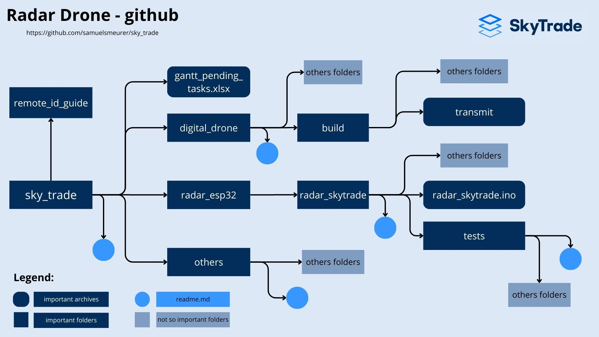

# Drone Radar Project - Sky Trade Hardware Sector

## Repository Structure
This repository serves as the standard base for the drone radar project development within the Hardware sector of Sky Trade. Below, the image illustrates the organization of the repository folders, making it easier to locate specific information.

## Main Files and Folders

### [`gantt_pending_tasks.xlsx`](https://github.com/samuelsmeurer/sky_trade/tree/main/gantt_pending_tasks.xlsx)
This file contains a list of ongoing and pending tasks, providing an overview of the project backlog and planning.

### [`digital_drone`](https://github.com/samuelsmeurer/sky_trade/tree/main/digital_drone) Folder
This folder contains the code and procedures necessary to run a "digital drone" on your computer. This system simulates the transmission of information via the Remote ID protocol, essential for testing the drone identification radar in the absence of a physical drone. For more details on execution, refer to the guidance document inside this folder.

### [`radar_esp32`](https://github.com/samuelsmeurer/sky_trade/tree/main/radar_esp32/radar_skytrade) Folder
Here you will find the software and tests related to the drone radar using the ESP32 microcontroller. It includes detailed instructions on how to compile and upload the code to the ESP32 board, along with information about ongoing tests.

### [`others`](https://github.com/samuelsmeurer/sky_trade/tree/main/others) Folder
This folder stores secondary files, such as images used in this repository and additional test codes. An internal document summarizes all relevant additional information.

## Suggesting Improvements

Contributions to improve the documentation and code are always welcome. If you have suggestions or improvements, please open an issue or submit a pull request.

