# Radar Drone
This software is used on the ESP32 microcontroller to identify drones via WiFi by Sky Trade.

**Root repository:** [https://github.com/sxjack/uav_electronic_ids](https://github.com/sxjack/uav_electronic_ids)

## Hardware Settings

What you need:
- An ESP32;
- A cable that connects the ESP32 to the computer (USB – microUSB/USB-C).

### Steps:
1. Connect the ESP32 to the computer.
2. Check in the "Device Manager" if the ESP is recognized. If it is recognized, it will appear as follows:
   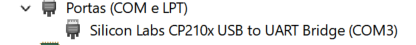
3. If it is not recognized, visit -> [Silabs Drivers](https://www.silabs.com/developer-tools/usb-to-uart-bridge-vcp-drivers?tab=downloads)
   1. Download the driver:
      
   2. Extract the downloaded folder and execute the file:
      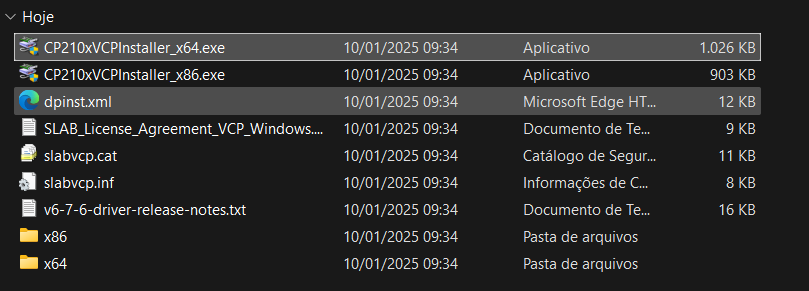
   3. Complete the installation.
   4. Enter the Device Manager again and verify if the port has been recognized, as demonstrated in the photo from step 2.
4. Keep the ESP32 cable connected to the USB port.

## Software Settings:

### Installing the Repository:
In the terminal, execute the command:

'''
git clone https://github.com/samuelsmeurer/sky_trade
'''

### Downloading the Arduino IDE
1. Download the Arduino IDE from -> [Arduino Software](https://www.arduino.cc/en/software)
2. Extract the files and execute them.

### Configuring the IDE and Uploading Code to the ESP32 Microcontroller
1. Open the Arduino IDE.
2. Update the necessary libraries:
   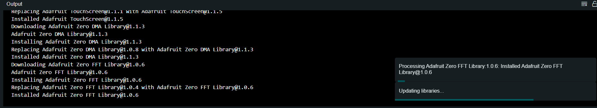
3. Click to open the folder `skytrade/radar_esp32/radar_skytrade`.
4. Ensure that the ESP32 cable is connected to the USB port and click on the board selection box:
   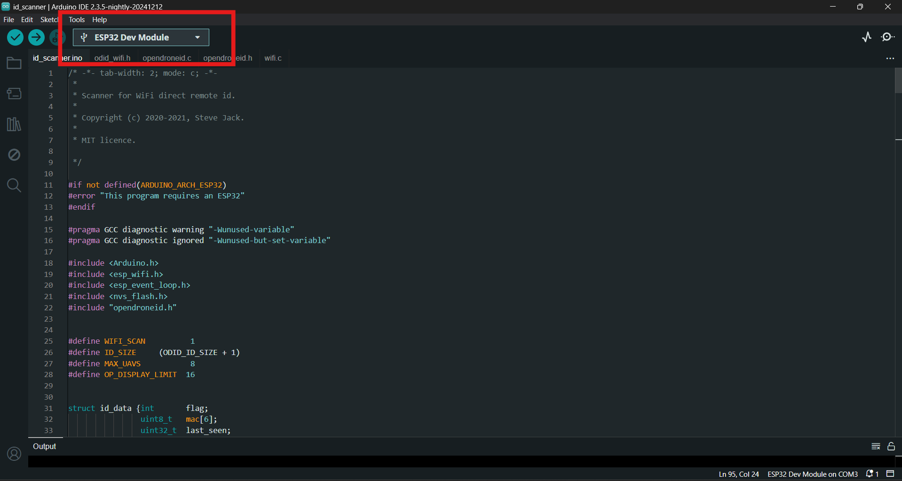
5. Type "ESP32 Dev Module" and confirm.
   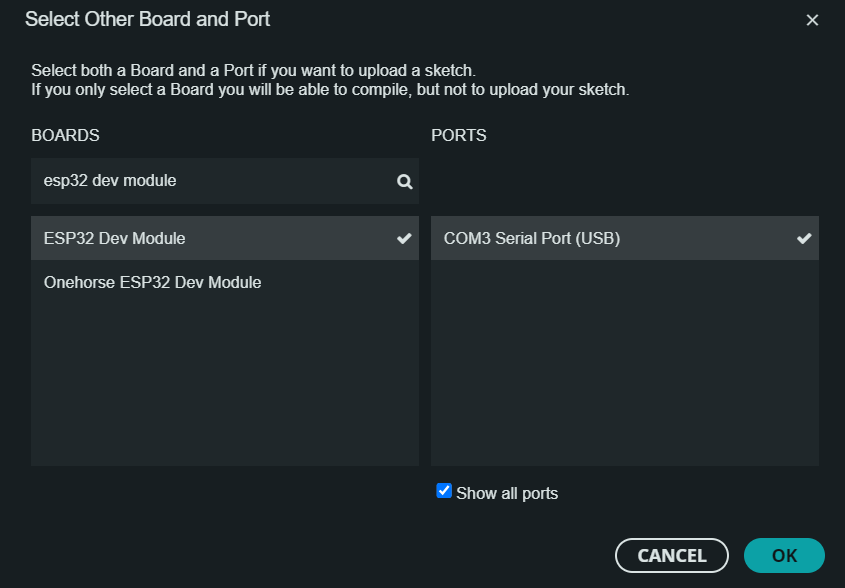
6. Click on verify and confirm that the compilation was successful.
   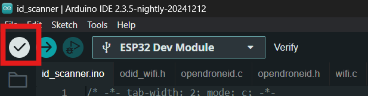
7. If everything was correct, the following message will appear in the terminal:
   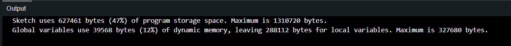
8. Now confirm that the port is connected and recognized:
   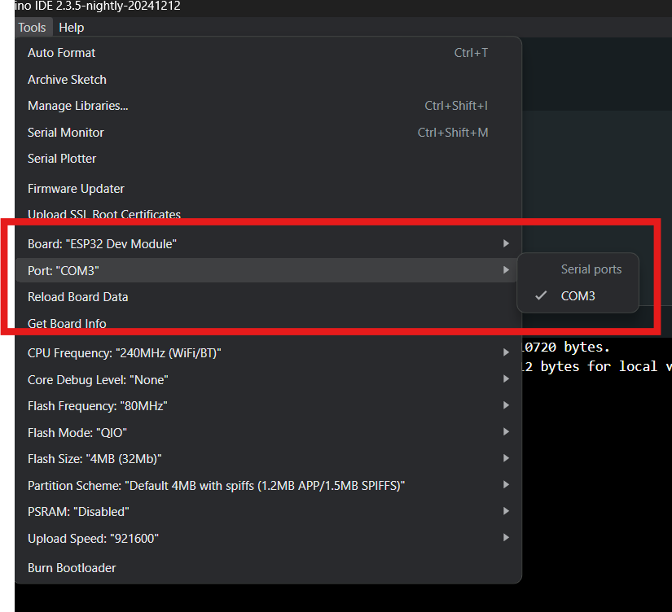
10. Click the Upload button to send the code to the ESP32:
    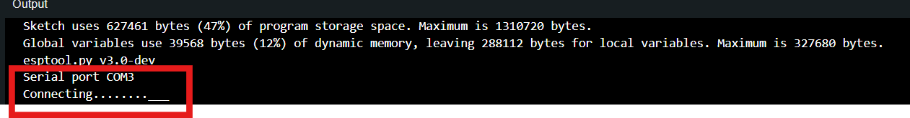
    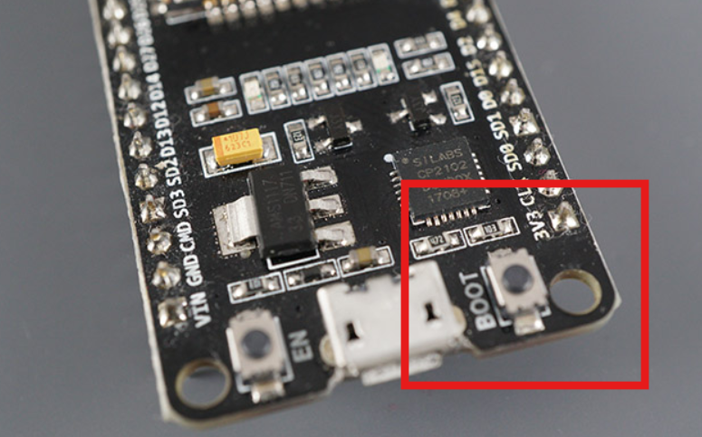
12. To confirm that everything went correctly, the percentages of the code being written to the microcontroller ESP32 will be displayed:
    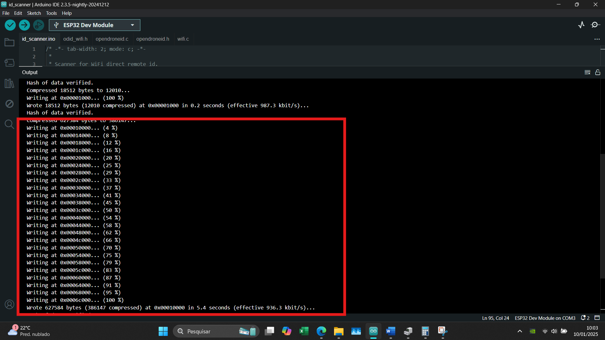
13. After this, the hardware is already detecting drones via the Remote ID protocol over WiFi. To check if a drone has been found, you can click on the serial monitor:
    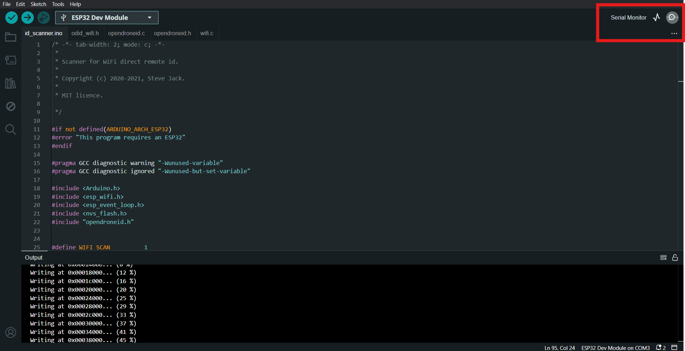
14. Ensure that the baud rate is set to 115200:
    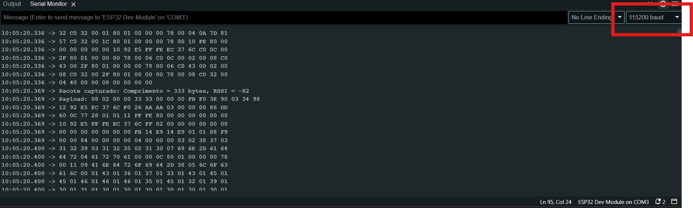
15. If there is any problem, close and reopen the serial monitor.
16. When a drone is detected, a longer message like this will be seen:
    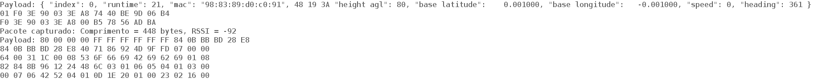

